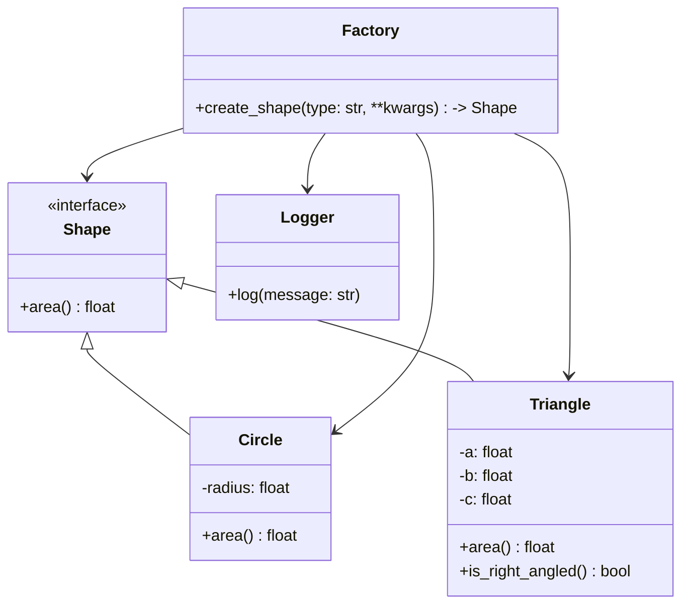

# Описание проекта

**shape_calculator_lib** - проект Python-библиотеки, которая позволяет вычислять площади различных геометрических фигур,
таких как круги и треугольники.

## Концепция и Дизайн

- **Абстракция** (интерфейс): создан абстрактный базовый класс Shape с методом area(). Каждый конкретный класс
  фигуры (Circle, Triangle) наследуется от Shape и реализует этот метод. Это делает систему легко расширяемой: для
  добавления новой фигуры достаточно создать новый класс, унаследовать его от Shape и реализовать area().
- **Полиморфизм**: каждая функция, которая принимает на вход любой объект типа Shape (или его потомка), может вызывать
  метод area(), не зная, какая именно это фигура. Это решает задачу _вычисление площади без знания типа фигуры_.
- **Фабричный Метод**: создана функция create_shape, оторая по строковому идентификатору ("circle", "triangle") и
  параметрам возвращает нужный объект фигуры.
- **Инкапсуляция**: каждая фигура при создании автоматически проверяет свои параметры ( например, радиус должен быть
  положительным, а стороны треугольника должны удовлетворять неравенству треугольника).

## Структура Проекта

```
shape_calculator_lib/
├── .gitignore
├── pyproject.toml              # Конфигурация проекта и зависимостей
├── example.py                  # Пример использования библиотеки
├── README.md
├── src/
│   └── shape_calculator/
│       ├── __init__.py
│       ├── exceptions.py       # Пользовательские исключения
│       ├── factory.py          # Фабрика для создания фигур
│       ├── shapes/
│       │   ├── __init__.py
│       │   ├── base_shape.py   # Абстрактный класс Shape
│       │   ├── circle.py
│       │   └── triangle.py
│       └── utils/
│           └── logger.py       # Настройка логгирования
└── tests/
    ├── test_circle.py
    ├── test_triangle.py
    ├── test_factory.py
    └── test_polymorphism.py
```

## Установка

Для установки библиотеки выполните:
```bash
pip install .
```

## Использование
### Прямое создание объектов
Вы можете импортировать классы фигур напрямую и вычислять их площадь.

```python
from src.shape_calculator import Circle, Triangle
from src.shape_calculator.exceptions import InvalidDimensionsError

try:
    # Создаем круг
    circle = Circle(radius=10)
    print(f"The area of the circle: {circle.area():.2f}") # -> Площадь круга: 314.16

    # Создаем треугольник
    triangle = Triangle(a=3, b=4, c=5)
    print(f"The area of the triangle: {triangle.area()}") # -> Площадь треугольника: 6.0

    # Проверяем, является ли треугольник прямоугольным
    if triangle.is_right_angled():
        print("The triangle is rectangular.")

except InvalidDimensionsError as e:
    print(f"Shape creation error: {e}")
```

### Вычисление площади без знания типа фигуры
```python
from src.shape_calculator import Circle, Triangle, Shape

shapes: list[Shape] = [
    Circle(1),
    Triangle(3, 4, 5),
    Triangle(5, 5, 5)
]

for shape in shapes:
    # Тип фигуры неизвестен, но можно вызвать метод area()
    print(f"The area of the shape type {type(shape).__name__} equal to {shape.area():.2f}")
```

### Пример использования билиотеки как API
```python
from src.shape_calculator import create_shape
shape = create_shape("circle", radius=5)
print(f"The area of the shape is: {shape.area():.2f}")
```


## Расширяемость: Добавление новых фигур
Добавить новую фигуру можно таким образом:
- Создайте новый класс, унаследованный от shape_calculator.Shape.
- Реализуйте в нем метод area() -> float.
- Добавьте его в shape_calculator.factory для создания через фабрику.


## Тестирование
Для запуска тестов установите dev-зависимости и выполните:
```bash
pytest
```

## Cхема реализации


