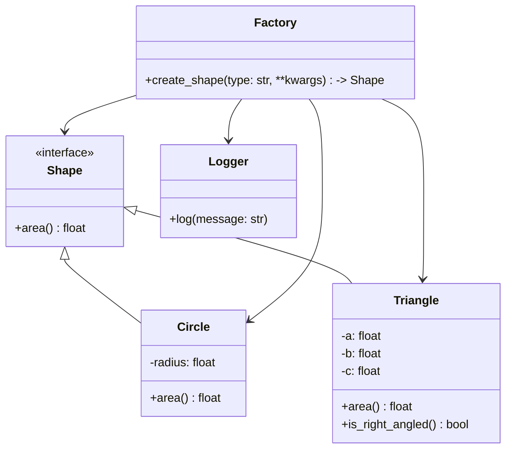

# Описание проекта

**shape_calculator_lib** - проект Python-библиотеки, которая позволяет вычислять площади различных геометрических фигур,
таких как круги и треугольники.

## Концепция и Дизайн

- **Абстракция** (интерфейс): создан абстрактный базовый класс Shape с методом area(). Каждый конкретный класс
  фигуры (Circle, Triangle) наследуется от Shape и реализует этот метод. Это делает систему легко расширяемой: для
  добавления новой фигуры достаточно создать новый класс, унаследовать его от Shape и реализовать area().
- **Полиморфизм**: каждая функция, которая принимает на вход любой объект типа Shape (или его потомка), может вызывать
  метод area(), не зная, какая именно это фигура. Это решает задачу _вычисление площади без знания типа фигуры_.
- **Фабричный Метод**: создана функция create_shape, оторая по строковому идентификатору ("circle", "triangle") и
  параметрам возвращает нужный объект фигуры.
- **Инкапсуляция**: каждая фигура при создании автоматически проверяет свои параметры ( например, радиус должен быть
  положительным, а стороны треугольника должны удовлетворять неравенству треугольника).

## Структура Проекта

```
shape_calculator_lib/
├── .gitignore
├── pyproject.toml              # Конфигурация проекта и зависимостей
├── example.py                  # Пример использования библиотеки
├── README.md
├── src/
│   └── shape_calculator/
│       ├── __init__.py
│       ├── exceptions.py       # Пользовательские исключения
│       ├── factory.py          # Фабрика для создания фигур
│       ├── shapes/
│       │   ├── __init__.py
│       │   ├── base_shape.py   # Абстрактный класс Shape
│       │   ├── circle.py
│       │   └── triangle.py
│       └── utils/
│           └── logger.py       # Настройка логгирования
└── tests/
    ├── test_circle.py
    ├── test_triangle.py
    ├── test_factory.py
    └── test_polymorphism.py
```

## Установка

Для установки библиотеки выполните:
```bash
pip install .
```

## Использование
### Прямое создание объектов
Вы можете импортировать классы фигур напрямую и вычислять их площадь.

```python
from src.shape_calculator import Circle, Triangle
from src.shape_calculator.exceptions import InvalidDimensionsError

try:
    # Создаем круг
    circle = Circle(radius=10)
    print(f"The area of the circle: {circle.area():.2f}") # -> Площадь круга: 314.16

    # Создаем треугольник
    triangle = Triangle(a=3, b=4, c=5)
    print(f"The area of the triangle: {triangle.area()}") # -> Площадь треугольника: 6.0

    # Проверяем, является ли треугольник прямоугольным
    if triangle.is_right_angled():
        print("The triangle is rectangular.")

except InvalidDimensionsError as e:
    print(f"Shape creation error: {e}")
```

### Вычисление площади без знания типа фигуры
```python
from src.shape_calculator import Circle, Triangle, Shape

shapes: list[Shape] = [
    Circle(1),
    Triangle(3, 4, 5),
    Triangle(5, 5, 5)
]

for shape in shapes:
    # Тип фигуры неизвестен, но можно вызвать метод area()
    print(f"The area of the shape type {type(shape).__name__} equal to {shape.area():.2f}")
```

### Использование в веб-сервисе (например, FastAPI)
1. Создать эндпоинт, например, `/calculate_area`, который принимает JSON с описанием фигуры и возвращает ее площадь.
2. Создайте файл `requirements.txt` в корне вашего проекта и добавьте туда зависимости. Пример:
    ``` bash
        # requirements.txt
        fastapi
        uvicorn
        shape-calculator @ git+https://github.com/DalekTek/shape_calculator_lib.git@test
    ```
3. Создайте код веб-сервиса. Пример main.py: 
    ```python
   from fastapi import FastAPI, HTTPException
   from pydantic import BaseModel, Field
   from typing import Literal, Dict, Any
   
   # Импортируем компоненты API
   from shape_calculator import create_shape, ShapeError
   # Создаем приложение FastAPI
   app = FastAPI(
   title="Shape Area Calculator API",
   description="An API that uses the shape-calculator library to calculate area of shapes."
   )
   # Определяем модель входных данных с помощью Pydantic
   class ShapeRequest(BaseModel):
        shape_type: Literal["circle", "triangle"] = Field(..., description="The type of the shape.")
        parameters: Dict[str, Any] = Field(..., description="Parameters for the shape, e.g., {'radius': 10} or {'a': 3, 'b': 4, 'c': 5}")
   
   @app.post("/calculate_area", summary="Calculate the area of a shape")
   def calculate_area(request: ShapeRequest):
        """
        Принимает тип фигуры и ее параметры, возвращает вычисленную площадь.

        - **shape_type**: "circle" или "triangle"
        - **parameters**: словарь с параметрами.
          - Для круга: `{"radius": float}`
          - Для треугольника: `{"a": float, "b": float, "c": float}`
        """
        try:
            # Здесь мы используем API нашей библиотеки!
            # Фабрика create_shape - идеальный инструмент для такого сценария.
            shape = create_shape(request.shape_type, **request.parameters)

            # Вызываем метод area(), гарантированный "контрактом" API.
            area = shape.area()

            response = {"shape_type": request.shape_type, "area": area}
   
            # Используем специфичный для треугольника метод, если это возможно
            if request.shape_type == "triangle":
                # Мы можем быть уверены в типе, т.к. shape успешно создался
                from shape_calculator import Triangle
                if isinstance(shape, Triangle):
                    response["is_right_angled"] = shape.is_right_angled()

            return response

        except ShapeError as e:
            # Ловим КОНКРЕТНЫЕ ошибки из нашей библиотеки и превращаем их
            # в осмысленный ответ клиенту с кодом 400 (Bad Request).
            raise HTTPException(status_code=400, detail=f"Invalid shape data: {e}")
        except ValueError as e:
            # Ловим ошибку от фабрики, если тип фигуры неизвестен
            raise HTTPException(status_code=400, detail=str(e))
        except Exception as e:
            # Общая обработка на случай непредвиденных ошибок
            raise HTTPException(status_code=500, detail=f"An unexpected error occurred: {e}")
    ```
4. Чтобы запустить выполните: `uvicorn main:app --reload` 
5. Чтобы протестировать эндпоинт, нужно отправить на него POST запрос с данными в формате JSON. 
6. Для отправки POST запроса можно использовать Swagger UI.
   1. Откройте в браузере адрес: http://127.0.0.1:8000/docs
   2. Вы увидите автоматически сгенерированную страницу с документацией вашего API. Там будет раздел для эндпоинта POST /calculate_area. 
   3. Нажмите на этот раздел, чтобы развернуть его. Вы увидите синюю кнопку "Try it out". Нажмите на неё. 
   4. Появится поле "Request body", уже заполненное примером JSON на основе вашей Pydantic-модели ShapeRequest. 
   5. Отредактируйте этот JSON, чтобы передать данные для фигуры, которую вы хотите протестировать. Например, для треугольника:
       ```json
        {
            "shape_type": "triangle",
            "parameters": {
            "a": 3,
            "b": 4,
            "c": 5
            }
        }
      ```
   6. Нажмите большую синюю кнопку "Execute". 
   7. Ниже вы увидите результат:
      ```txt
          Curl: Команда, которую можно использовать в терминале для повторения запроса. 
          Request URL: Адрес, на который был отправлен запрос. 
          Server response: Ответ от вашего сервера. Если все успешно, вы увидите что-то вроде:
          Code: 200 
          Response body:
          {
           "shape_type": "triangle",
           "area": 6,
           "is_right_angled": true
          }
      ```

## Расширяемость: Добавление новых фигур
Добавить новую фигуру можно таким образом:
- Создайте новый класс, унаследованный от shape_calculator.Shape.
- Реализуйте в нем метод area() -> float.
- Добавьте его в shape_calculator.factory для создания через фабрику.


## Тестирование
Для запуска тестов установите dev-зависимости и выполните:
```bash
pytest
```

## Cхема реализации


